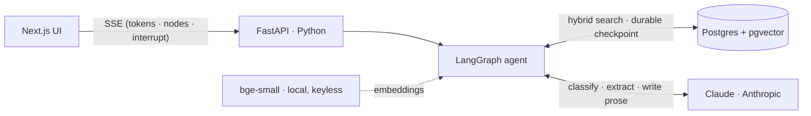
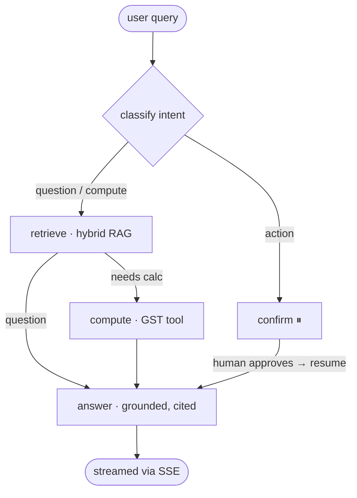

# LedgerLens

[](https://github.com/pratikrevankar/ledgerlens/actions/workflows/ci.yml)

**A citation-grounded GST compliance agent.** Ask a real Indian-tax question in
plain English; LedgerLens retrieves the governing provision, runs the exact tax
math in code (never the model), and answers **with a citation after every claim —
or refuses if it has no source.** State-changing actions pause for human approval.

> **Honest framing:** I run the production version of this pattern in TypeScript on
> Vercel (a multi-jurisdiction financial platform with a live pgvector RAG). This
> repo is a **self-contained Python / FastAPI / LangGraph reference implementation**
> of the same agent — built to show the applied-AI stack end to end, not as a toy.

---

## What it does

> *"We sold ₹50,000 of consulting to a client in another state. What's the GST, and
> which section decides place of supply?"*

1. **Classify** — question, calculation, or a state-changing action?
2. **Retrieve** — hybrid search (dense pgvector + sparse full-text, fused with RRF)
   over 25 real GST provisions → returns the text **and its citation**.
3. **Compute** — a deterministic Python tool returns IGST ₹9,000 (inter-state,
   IGST Act s.7); place of supply = recipient's location (s.12).
4. **Human-in-the-loop** — if you say *"record this,"* the graph **interrupts** and
   waits for your approval before it would commit anything.
5. **Answer** — streamed token-by-token, **every claim cited**; unsupported → *"I
   don't have a source for that."*
6. **Verify (Reflexion)** — a critic re-checks the draft against the retrieved
   context: a *deterministic* pass rejects any invented citation, then an LLM
   entailment pass flags unsupported claims. If either fails, the graph loops back
   once and **self-corrects** before answering.

## Architecture

**System** — the browser streams from a Python API; the agent grounds in pgvector,
computes in code, and persists its human-in-the-loop state in Postgres. The LLM is
used only to classify, extract, and write:



**Agent graph** — steps have different trust levels, so each is its own node.
Actions divert to a human-approval interrupt before anything is "committed":



- **Hybrid retrieval** — dense embeddings catch paraphrase, keyword catches exact
  statutory terms (`section 16`, `LUT`, `ITC`); [Reciprocal Rank Fusion](backend/app/retrieval.py) merges them.
- **Local embeddings** (BAAI/bge-small, 384-dim, fastembed) — retrieval needs **no API key**; only generation needs one.
- **Math is code, not the model** — [`compute_gst`](backend/app/tools.py) is pure + unit-tested; the LLM only decides *when* to call it.
- **Durable human-in-the-loop** — the interrupt/resume checkpoint lives in Postgres, so a paused run survives a restart or serverless cold start.

> The reasoning behind each of these choices — and the trade-offs — is written up in **[DESIGN.md](DESIGN.md)**.

## Quickstart

```bash
cp backend/.env.example backend/.env      # add your ANTHROPIC_API_KEY
docker compose up --build                 # db + backend + UI; seeds the corpus on boot
```

Open the chat at **http://localhost:3000**, or hit the streaming API directly:

```bash
curl -N -X POST localhost:8000/chat -H 'content-type: application/json' \
  -d '{"query":"GST on a 50000 inter-state consulting sale from Karnataka to Maharashtra?","thread_id":"t1"}'
```

You'll see SSE frames: `node` (which step is running) → `citations` → streamed
`token`s → `done`. Ask *"record a 50000 sale to Maharashtra"* and you'll get an
`interrupt` frame; approve it via `POST /resume {"thread_id":"t1","approved":true}`.

## Evals

Three tiers, cheapest-first — each doubles as a CI gate (non-zero exit on regression):

```bash
cd backend
pytest evals/test_gst_tool.py evals/test_reranker.py   # pure: math + reranker + citation checks (no infra)
python -m evals.run_evals                              # retrieval: recall@k / MRR, reranker off vs on (needs db)
python -m evals.run_llm_evals                          # generation: LLM-as-judge + adversarial (needs db + key)
```

**1 · Deterministic guardrails** — the GST math is pinned in `test_gst_tool.py`
(the LLM never computes), and the reranker/citation logic is unit-tested with an
injectable scorer, so it runs with no DB, key, or model download.

**2 · Retrieval quality (`run_evals.py`)** — recall@k and MRR over a labelled set,
measured across configurations so every lift is quantified, not asserted. On the
27-case set (`top_k=4`), all runs keyless (embeddings + reranker are local):

| config | recall@4 | MRR |
|---|---|---|
| hybrid (dense + sparse, RRF) | 89% | 0.790 |
| + cross-encoder reranker | 93% | 0.861 |
| + contextual retrieval (`CONTEXTUAL_RETRIEVAL=template`) | **93%** | **0.864** |
| contextual + reranker | 93% | 0.843 |

Two levers, and the honest finding: the **reranker** (`app/reranker.py`, fastembed
cross-encoder) re-scores the fused shortlist jointly per (query, provision) pair —
89%→93%, MRR +0.07. **Contextual Retrieval** (`app/contextualize.py`, Anthropic's
technique — a situating prefix is embedded with each provision) reaches the same
recall *at retrieval time*, edging MRR slightly higher. On this small, already
self-contained corpus the two are **substitutes near the ceiling** — stacking them
doesn't compound (the reranker even nudges MRR down once retrieval is well-ordered).
On a large, fragmented corpus they'd combine; here the measurement says pick one.
Both degrade gracefully and are off/keyless by default; `CONTEXTUAL_RETRIEVAL=llm`
uses the model to write the context (needs a key, prompt-cached across provisions).

**3 · Generation quality (`run_llm_evals.py`)** — runs the full agent, then grades
each answer with an **LLM-as-judge** (faithfulness + answer-relevance, RAGAS-style)
plus a **deterministic citation-validity** check (every `[Act, s.X]` cited must be
in the retrieved context — catches invented citations). An **adversarial suite**
(`adversarial.jsonl`) verifies the agent refuses out-of-scope/no-source questions
and shrugs off prompt-injection in the query rather than getting hijacked.

## Prompt caching

The answer node marks its static system prompt + retrieved context as cacheable
(`app/prompt_cache.py`, Anthropic `cache_control`). Those tokens are IDENTICAL on
the first draft and the Reflexion self-correction pass for a given query, so the
second call reads them from cache — lower latency and ~10× cheaper on the reused
input. The ingest-time contextualizer likewise caches the corpus overview across
all 25 provisions. Anthropic only caches a prefix above a per-model minimum, so on
a short context the marker is a harmless no-op; toggle with `PROMPT_CACHE`.

## Observability

Set `LANGSMITH_TRACING=true` + a `LANGSMITH_API_KEY` in `.env` to trace every run,
node transition and tool call in LangSmith.

## Stack

| Layer | Choice | Why |
|---|---|---|
| Agent | **LangGraph** | Explicit state machine: per-step trust boundaries + human-in-the-loop `interrupt` |
| API | **FastAPI** (async, SSE) | Token + tool-event streaming without Edge tricks |
| Vector | **Postgres + pgvector** | Real hybrid retrieval, mirrors production |
| Embeddings | **fastembed / bge-small** | Local, key-less, offline-runnable retrieval |
| LLM | **Anthropic Claude** | Classify, extract, and write the grounded answer |
| UI | **Next.js (App Router)** | Streaming chat client |

## What this demonstrates

Grounded RAG with citations · a real agent state machine · tool-use with a
deterministic calculator · human-in-the-loop approval · SSE streaming · evals as a
regression gate · one-command Docker repro. A regulated-domain agent, not a
PDF-chat demo.

*Corpus: illustrative summaries of real CGST/IGST Act 2017 provisions — verify
against the bare Act before any production use.*
